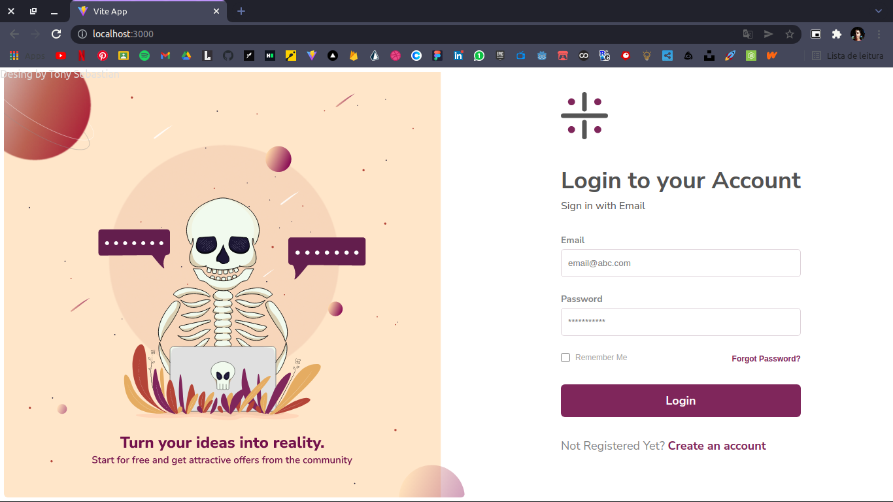
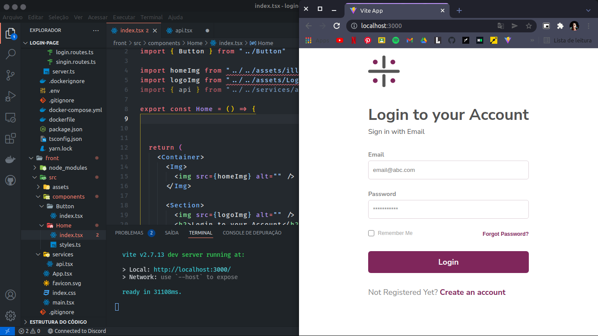
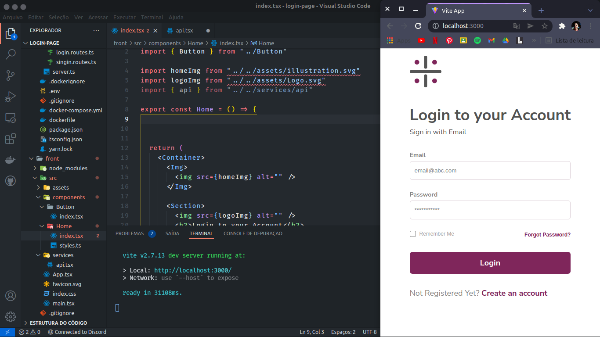

<h2>Login Page</h2>
<p>Projeto feito para treinar minhas habilidades como desenvolvedor fullstack.</p>
<hr size="1px" color="gray">
<p>Depois de clona o projeto de um ```yarn``` na pasta front, na pasta back,
  crie as ```migrations``` do prisma com o comando ```yarn prisma migrate dev --name init```,
  na parte do nome, você pode dar qualquer nome, mas eu deixei como um simples <strong>init</strong>
  de o comando ```docker up``` é um ```docker-compose up```,
</p>
<hr size="1px" color="gray">
<h3>Dê umA espiada no projeto</h3>
<p>Obs. fiz essa página com o conceito desktop first</p>
<br/>

<br/>

<br/>
